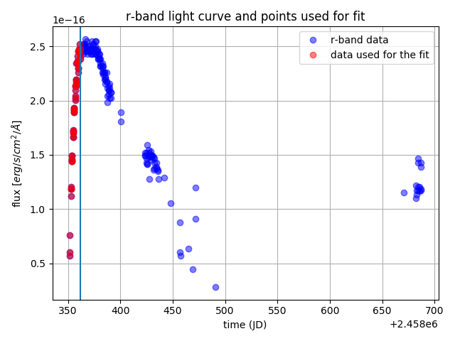

# PhotoManip
`PhotoManip` is a package to manipulate, convert and model SNe Photometry.

[](https://pypi.python.org/pypi/PhotoManip)

## Documentation

## Credit

## How to install `PhotoManip`?

### pip

`pip install PhotoManip`

### Python version
* `python 3`

### Required python packages
* `math`
* `numpy`
* `scipy`
* `pylab`
* `emcee`
* `pylab`
* `pandas`
* `csv`

## How to run `PhotoManip`?
Before running anything, you first need to define the path of a directory where all your transmission curves are stored. We provide such a directory with the package.
```python
>>> import PhotoManip
>>> from PhotoManip import PhotoManip_fun
>>> filters_directory='./Filters' 
```

### Convert a mag (AB) value in a given band into a flux value.

```python
>>> mag_value=20.55 #this is the magAB  value to convert
>>> flux=PhotoManip_fun.magAB_in_filter_to_flux_in_filter(mag_value,Filter_vector=np.array([['swift','UVW2']]),filters_directory=filters_directory,verbose=False)
>>> print('the flux is',flux)
flux is 1.55285808219e-16
```

### Convert data downloaded from the Marshall into the format 'jd','mag','magerr','flux','fluxerr','absmag','absmagerr','filter','instr'.

First define the path of the photometry file downloaded from the Marshall
```python
data_path='./data_Marshall_test.txt'# a file downloaded from the Marshall
```
Then define the path of the output file

```python
output_path='./data_formatted_test.txt' #path to the file with the right format
```
Then run
```python
PhotoManip_fun.read_data_Marshall_simple(data_path,no99=True,filters_directory=filters_directory,output_path=output_path)
```

### Calculate the time "tref" at which the flux in a given band crosses zero

The explosion date is often approximated by the extrapolated time at which the flux (e.g. in the r-band) crosses zero. `PhotoManip` allows you to calculate this time by modeling the light curve with
1. a concave exponent
2. a power law

and then chosing the best model.

First, specify the band you would like to use (r or g), the path to the data (the data should be in the format 'jd','mag','magerr','flux','fluxerr','absmag','absmagerr','filter','instr'; see in the previous section how to produce such format from Marshall-downloaded data) and the number of points you would like to include in the fit:
```python
data='./data_formatted_test.txt'
band='r'
days_rising=10
```

Then run
```python
tref=PhotoManip_fun.tref_from_P48('./data_formated_aatqzim.txt',band=band,days_rising=days_rising)[0]
```

The code will first show you the light curve and nmber of points to include in the fit, and warn you to adjust the `days_rising` parameter.
```python
***************************************************
******* IMPORTANT CHECK BEFORE YOU PROCEED ********
The red points shwon on the plot are the points which will be used for the fit.Adjust the "days_rising" parameter of Photomanip_fun.tref_from_P48, untill the red points cover all (and do not go beyond) the rising part of the light curve!
***************************************************
```


<p align="center">
  
</p>

It will the run mcmc to model the rising chunk with both a concave exponent and a power law, output plots and summarize the results for you:
```python
*************************************************************
****** CALCULATION OF tref (FIT WITH CONCAVE EXPONENT) ******
****************  eo*[1-exp(-[t-tref]/to)]   ****************
*************************************************************
*** EMCEE run ***
Mean acceptance fraction: 0.53524
*** Calculation of the maximum likelihood values ***
the best fit param are [  2.57541269e-16   3.62989755e+00   2.45835088e+06] and the corrisponding chi^2 is 25.752805826227736
the reduced chi^2 is 0.505
*** Plots of the best fit solution ***
*** Plots of the 2D distributions ***
WARNING:root:Too few points to create valid contours
WARNING:root:Too few points to create valid contours
WARNING:root:Too few points to create valid contours
*** Plots of the 1D distributions ***
********************************************
when fitting whith the exponent, the best fit is [  2.57541269e-16   3.62989755e+00   2.45835088e+06], with sigma is [  1.60233310e-16   6.24634462e+00   1.33451876e-01]
******************************************************
****** CALCULATION OF tref (FIT WITH POWER LAW) ******
*************        a(t-tref)^n        **************
******************************************************
*** EMCEE run ***
Mean acceptance fraction: 0.59778
*** Calculation of the maximum likelihood values ***
the best fit param are [  1.11625447e-16   3.58772217e-01   2.45835171e+06] and the corrisponding chi^2 is 33.4410034808209
the reduced chi^2 is 0.6557
*** Plots of the best fit solution ***
*** Plots of the 2D distributions ***
WARNING:root:Too few points to create valid contours
WARNING:root:Too few points to create valid contours
WARNING:root:Too few points to create valid contours
*** Plots of the 1D distributions ***
********************************************
when fitting whith the power law, the best fit is [  1.11625447e-16   3.58772217e-01   2.45835171e+06], with sigma is [  3.30022991e-18   1.64571738e-02   5.18314866e-02]
**********************************************************
****** SUMMARY OF tref CALCULATION WITH BOTH MODELS ******
**********************************************************
exponential:
t_ref=2458350.876016173, chi2_reduced=0.5049569769848575
power law:
t_ref=2458351.707039889, chi2_reduced=0.6557059506043315
the best fit is obtained with the exponential, i.e. tref=2458350.876016173
```

All plots can be found in the `results_tref_calculator_from_P48R` directory (or `results_tref_calculator_from_P48G` depending on the band you chose).
 

## Give it a try with the test data!

All the figures above were obtained by running `PhotoManip` on the multiple-bands light curve of the Supernova 2018fif ([Soumagnac et al 2019](https://ui.adsabs.harvard.edu/abs/2019arXiv190711252S/abstract)). The data is available in the `test` directory (including the output of the time-consuming interpolation step). You can reproduce all these results and figures by running `PhotoManip` the above examples in the `test` directory.


